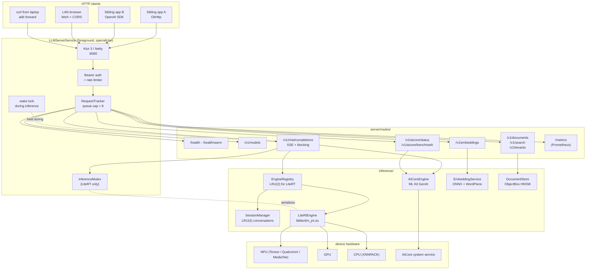
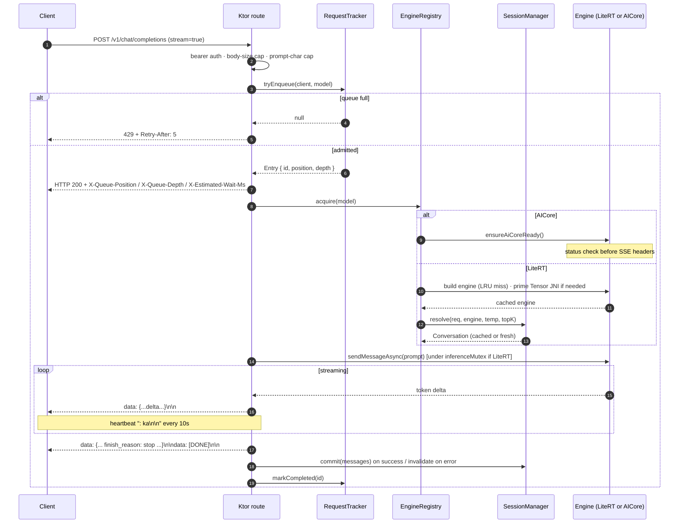

<div align="center">

# LocalLLM Edge Server

**The local-first LLM daemon for Android. One OpenAI-compatible HTTP endpoint, two on-device engines, every app on the phone.**

[](https://www.apache.org/licenses/LICENSE-2.0)
[](https://developer.android.com/about/versions/10)
[](https://kotlinlang.org)
[](https://ktor.io)
[](https://github.com/google-ai-edge/LiteRT)
[](https://developer.android.com/ml/aicore)
[](.github/workflows/build.yml)
[](http://www.tahabouhsine.com/localllm/)

[**Getting started**](docs/getting-started.md) · [**HTTP API**](docs/api.md) · [**Architecture**](docs/architecture.md) · [**Development**](docs/development.md) · [**Changelog**](CHANGELOG.md)

</div>

---

## Why this exists

Most apps already talk to LLMs over HTTP — they hit OpenAI, Anthropic, or a self-hosted endpoint with a JSON request and stream tokens back. The moment you try to move that inference **on-device**, that contract breaks: every app has to embed its own runtime (MediaPipe, LiteRT, llama.cpp, ONNX, AICore bindings) in Kotlin/Swift, ship its own copy of the weights, and load its own engine into memory. Three apps that each want to run a 2 GB model now want 6 GB of RAM and three independent inference threads competing for the same CPU/GPU/NPU. There is no queue, no scheduler, no shared cache — just N processes all trying to warm up the same hardware at the same time.

**The goal of this project is to be the one place on the device where LLMs actually run.** Apps keep doing what they already do — speak HTTP to an OpenAI-compatible endpoint — and point at `http://127.0.0.1:8080` instead of `api.openai.com`. The server owns the model lifecycle: one engine per model, loaded once, serialized through a single inference mutex, with a bounded queue, per-client rate limits, idle eviction, KV-cache reuse across turns, and a Prometheus `/metrics` endpoint to watch it all. No cloud, no remote API key, no data leaves the device — and no two apps fighting for the accelerator.

It's the same idea as running [Ollama](https://ollama.com) on a laptop, except the daemon runs in your pocket.

---

## What it looks like

<div align="center">

| Catalog | Chat | Dashboard | Console | Settings |
|:-:|:-:|:-:|:-:|:-:|
|  |  |  |  |  |
| Download / import models, AICore status card, NPU-SoC match badge. | Streaming chat with system prompt, stop button, live tok/s, markdown. | Live queue, in-flight, history, per-client summaries, AICore benchmark. | Filterable in-memory log buffer with tag chips and copy-on-long-press. | 6 sections: Server, Inference, Security, Background, Limits, Startup. |

</div>

---

## TL;DR

```bash
# 1. Install the APK on a phone running Android 10+ (Pixel 8+ for Gemini Nano).
adb install -r app-debug.apk

# 2. Forward the port (or bind to LAN in Settings and use the phone's IP).
adb forward tcp:8080 tcp:8080

# 3. Talk to it like it's OpenAI.
curl http://127.0.0.1:8080/v1/chat/completions \
  -H "Content-Type: application/json" \
  -d '{
    "model": "gemini-nano-aicore",
    "messages": [{"role": "user", "content": "Say hi in one word."}]
  }'

# 4. Or stream with the OpenAI Python SDK — no code changes from cloud.
python - <<'PY'
from openai import OpenAI
client = OpenAI(base_url="http://127.0.0.1:8080/v1", api_key="not-needed")
for chunk in client.chat.completions.create(
    model="gemini-nano-aicore",
    messages=[{"role": "user", "content": "Tell me a joke about kernels."}],
    stream=True,
):
    print(chunk.choices[0].delta.content or "", end="", flush=True)
PY
```

The default model is **`gemini-nano-aicore`** — no download required on a supported Pixel. The catalog also ships **Gemma 4 E2B IT** (2.6 GB), **Gemma 4 E4B IT** (~4 GB), and seven NPU-compiled **Gemma 3 1B** SoC variants.

---

## Feature matrix

| Surface | What's in the box |
|---|---|
| **HTTP API** | OpenAI-compatible `/v1/chat/completions` (streaming SSE + blocking), `/v1/models`, `/v1/embeddings`, `/v1/aicore/status`, `/v1/aicore/benchmark`, RAG (`/v1/documents`, `/v1/search`, `/v1/tenants`), Prometheus `/metrics`, `/health`, and `/health/warm` for cold-start probes. Bearer-token auth, opt-in CORS, atomic queue cap with `429 Retry-After`. |
| **Engines** | **AICore (Gemini Nano)** via ML Kit GenAI Prompt API (`com.google.mlkit:genai-prompt:1.0.0-beta2`) — the default, no download. **LiteRT-LM** (`litertlm-android:0.12.0`) for any `.litertlm` bundle including 7 NPU-compiled Gemma 3 1B SoC variants. Each catalog entry declares its `Backend` (`AICORE`/`LITERT_CPU`/`LITERT_GPU`/`LITERT_NPU`) — **no fallback chain**. |
| **NPU acceleration** | Bundled Google Tensor dispatch lib (`libLiteRtDispatch_GoogleTensor.so`) for Pixel 6/9/10. Vendor delegates for Qualcomm (QAIRT, SM8550/8650/8750/8850) and MediaTek (NeuroPilot, MT6989/6991/6993) when the right `.litertlm` is on disk. Sample-app numbers: NPU ~10× faster than CPU on a same-gen Snapdragon. |
| **Multimodal** | Vision via OpenAI-shaped `image_url` parts (`data:` URLs + loopback HTTP). Images downscaled to ≤1024 px JPEG, capped at 5 MB, SSRF-blocked on non-loopback hosts. Audio support is on the roadmap. |
| **Function calling** | OpenAI-shaped `tools` / `tool_choice` (`"auto"` / `"none"` / specific function). The model emits `tool_calls`; the client executes; the client replies with `role: "tool"`. No auto-invocation. |
| **KV-cache reuse** | Pass a stable `session_id` and the server caches the LiteRT-LM `Conversation`. Follow-up turns only send new user messages — assistant turns echoed by the client are already in the model's KV cache. Prefix-hash validated; sampling-param change rebuilds. 4-entry LRU. |
| **RAG** | ObjectBox HNSW vector store (dim 384, DOT_PRODUCT on unit-norm vectors). Paragraph-aware chunker with sliding-window fallback. Per-tenant isolation keyed by `X-Client-Id` (or `User-Agent`). Projection queries — `listDocuments` never loads the embedding column. |
| **Embeddings** | ONNX Runtime 1.18 with WordPiece tokenizer in pure Kotlin. Batched `[batch, maxSeqLen]` tensor in one call. Mean-pooling with attention-mask + L2 normalization for cosine equivalence. |
| **Multi-client** | Per-client token-bucket rate limiting (`User-Agent` key, `429 Retry-After` + `X-RateLimit-Client` headers). Queue-position headers (`X-Queue-Position`, `X-Queue-Depth`, `X-Estimated-Wait-Ms`, `X-Request-Id`) flush before the first SSE byte. Embeddings + chat use separate mutexes — long generation never blocks embeddings. |
| **Observability** | Prometheus `/metrics` (counters + gauges, per-engine + per-client), live Dashboard tab (queue / history cap 50 / cumulative stats / client summaries), in-memory log ring buffer (200 entries) with filterable Console tab, AICore benchmark (TTFT + tokens/sec + total-ms). |
| **Discovery** | mDNS/NSD advertisement `_localllm._tcp` with TXT records (`api=openai-compat`, `path=/v1`, `health=/health`) when bound to LAN. |
| **Service** | Foreground service (`specialUse` / `on_device_inference`) with persistent notification + Stop action. Partial wake-lock held only during inference, with hard timeout. Idle engine eviction (default 5 min) and optional auto-stop. Boot autostart. Responds to `onTrimMemory` with LRU trim. |
| **Errors** | Structured `RichErrorResponse` with machine-readable codes (`AICORE_DOWNLOADABLE` 503, `AICORE_DOWNLOADING` 425, `AICORE_UNAVAILABLE` 503, `AICORE_BACKGROUND_BLOCKED` 403, `AICORE_RUNTIME_ERROR` 500, `LITERT_INIT_FAILED` 503) + actionable `next_steps`. Mid-stream failures land as a final SSE error chunk + `[DONE]`, never a silent disconnect. |
| **Security** | SHA-256 verification on catalog downloads. Optional bearer-token auth on every `/v1/*` route (`/health` and `/metrics` stay open). CORS off by default. No third-party telemetry. |
| **Release builds** | R8 minify + resource shrinker, per-ABI splits (`arm64-v8a` + universal). Baseline profiles generated via `:macrobenchmark` and consumed by R8 at release-build time. Debug-key fallback when signing properties are absent. |

---

## Architecture



See [`docs/architecture.md`](docs/architecture.md) for the full source tree, state ownership, and the LiteRT path through `EngineRegistry.acquire()` → `SessionManager.resolve()` → `Conversation.sendMessageAsync()`.

---

## Request flow (chat completion)



---

## Built-in model catalog

The catalog lives in `app/src/main/java/com/localllm/app/ModelCatalog.kt`. Each entry declares its `Backend` directly — no AUTO chain, no silent fallback.

| Model ID | Family | Backend | Size | Notes |
|---|---|---|---|---|
| `gemini-nano-aicore` | Gemini Nano | `AICORE` | — | Virtual entry. No download — the AICore system service provisions weights on first use. Pixel 8+ with AICore enrolled. **Host app must stay in foreground.** |
| `gemma-4-e2b` | Gemma 4 | `LITERT_CPU` | ~2.6 GB | Multimodal-ready. SHA-256 verified. |
| `gemma-4-e4b` | Gemma 4 | `LITERT_CPU` | ~4 GB | Larger, more accurate. SHA-256 verified. |
| `gemma3-1b-it-npu-sm8550` | Gemma 3 1B | `LITERT_NPU` | ~690 MB | Snapdragon 8 Gen 2 (QAIRT). |
| `gemma3-1b-it-npu-sm8650` | Gemma 3 1B | `LITERT_NPU` | ~690 MB | Snapdragon 8 Gen 3 (QAIRT). |
| `gemma3-1b-it-npu-sm8750` | Gemma 3 1B | `LITERT_NPU` | ~689 MB | Snapdragon 8 Elite / S25 (QAIRT). |
| `gemma3-1b-it-npu-sm8850` | Gemma 3 1B | `LITERT_NPU` | ~694 MB | Snapdragon 8 Elite Gen 5 (QAIRT). |
| `gemma3-1b-it-npu-mt6989` | Gemma 3 1B | `LITERT_NPU` | ~1.03 GB | MediaTek Dimensity 9300 (NeuroPilot). |
| `gemma3-1b-it-npu-mt6991` | Gemma 3 1B | `LITERT_NPU` | ~1.03 GB | MediaTek Dimensity 9400 (NeuroPilot). |
| `gemma3-1b-it-npu-mt6993` | Gemma 3 1B | `LITERT_NPU` | ~1.02 GB | MediaTek Dimensity 9500 (NeuroPilot). |
| `gemma3-1b-it-npu-tensor-g5` | Gemma 3 1B | `LITERT_NPU` | ~1.68 GB | Google Tensor G5 (Pixel 10). Bundled dispatch lib. |

The Catalog tab badges the NPU variant that matches `Build.SOC_MODEL`. Side-load anything else via **Settings → Custom model URLs** (one `.litertlm` URL per line) or **Catalog → Import .litertlm file from device**.

---

## HTTP API at a glance

| Method | Path | Auth | Purpose |
|---|---|:-:|---|
| `GET` | `/health` | open | Liveness, queue depth, cached engines, AICore status block. |
| `POST` | `/health/warm` | bearer | Force-warm an engine and wait for first-token-ready (60s timeout). |
| `GET` | `/v1/models` | bearer | List `.litertlm` files, ONNX embedding models, and the virtual `gemini-nano-aicore`. |
| `POST` | `/v1/chat/completions` | bearer | OpenAI chat. Streaming SSE + blocking. AICore for `gemini-nano-aicore`, otherwise LiteRT-LM. |
| `POST` | `/v1/embeddings` | bearer | Single or batched ONNX embeddings. |
| `POST`/`GET`/`DELETE` | `/v1/documents`[`/:id`] | bearer | RAG ingest / list / delete. Tenant-scoped. |
| `POST` | `/v1/search` | bearer | k-NN over the document store. |
| `GET`/`DELETE` | `/v1/tenants`[`/:id`] | bearer | Admin view + tenant wipe. |
| `GET` | `/v1/aicore/status` | bearer | Detailed Gemini Nano readiness probe (`?probe=all` for per-config breakdown). |
| `POST`/`GET` | `/v1/aicore/benchmark` | bearer | TTFT + tokens/sec + total-ms speed test. `GET` serves the last cached result. |
| `GET` | `/metrics` | open | Prometheus exposition (counters + gauges, per-engine + per-client labels). |

**Response headers on `/v1/chat/completions`:**
`X-Request-Id`, `X-Client-Id`, `X-Queue-Position`, `X-Queue-Depth`, `X-Estimated-Wait-Ms`, plus `Retry-After` + `X-RateLimit-Client` on 429.

**Structured error codes** (`RichErrorResponse.error.code`):
`AICORE_DOWNLOADABLE` (503), `AICORE_DOWNLOADING` (425), `AICORE_UNAVAILABLE` (503), `AICORE_BACKGROUND_BLOCKED` (403), `AICORE_RUNTIME_ERROR` (500), `LITERT_INIT_FAILED` (503). Each carries `actionable: bool` and `next_steps: string[]`.

Full reference: [`docs/api.md`](docs/api.md).

---

## Configuration (defaults)

All settings are observable `StateFlow`s backed by `androidx.datastore`. The Settings tab writes them; the server reads them; slider drags don't blow up the I/O path.

| Setting | Default | Range | Notes |
|---|---|---|---|
| `port` | **8080** | 1024–65535 | Live-validated against `ServerSocket`. |
| `bindLan` | `false` | bool | `false` → 127.0.0.1 only; `true` → 0.0.0.0 + mDNS advert. |
| `selectedModelId` | `gemini-nano-aicore` | enum | Default model when request omits `model`. |
| `maxTokens` | `1024` | int | Per-request total-token budget. |
| `temperature` | `0.8` | 0.0–2.0 | `SamplerConfig.temperature`. |
| `topK` | `40` | 1–100 | `SamplerConfig.topK`. |
| `requestTimeoutMs` | `120000` | ms | `withTimeout` budget; emits `408` or SSE error chunk. |
| `maxQueueDepth` | `8` | int | Atomic enforced by `RequestTracker.tryEnqueue`. |
| `maxPromptChars` | `100000` | int | Returns `413` if exceeded. |
| `rateLimitPerSec` | `0.0` (disabled) | float | Per-client token-bucket refill rate. |
| `rateLimitBurst` | `10.0` | float | Initial bucket size. |
| `idleEvictMs` | `300000` (5 min) | ms | Evict cached engines after N ms idle. 0 disables. |
| `idleStopMs` | `0` (disabled) | ms | Stop the foreground service after N ms idle. |
| `keepAwake` | `true` | bool | Hold `PARTIAL_WAKE_LOCK` during inference. |
| `apiKey` | `""` | string | Empty disables auth. |
| `allowCors` | `false` | bool | When true, installs `anyHost()`. |
| `startOnBoot` | `false` | bool | `BootReceiver` autostarts the service. |
| `autostart` | `false` | bool | Start the service on app launch. |
| `customModelUrls` | `""` | string | Newline-separated `.litertlm` URLs for the catalog. |

---

## Multi-turn with `session_id`

Pass a stable `session_id` and the server caches the LiteRT-LM `Conversation` across turns. Follow-up requests only re-feed new user messages — assistant turns echoed by the client are already in the model's KV cache and are skipped.

```jsonc
// Turn 1
POST /v1/chat/completions
{ "model": "gemma-4-e2b", "session_id": "alice-2026-05-10",
  "messages": [{"role": "user", "content": "Hi"}] }

// Turn 2 — same session_id, full history echoed (OpenAI convention)
POST /v1/chat/completions
{ "model": "gemma-4-e2b", "session_id": "alice-2026-05-10",
  "messages": [
    {"role": "user", "content": "Hi"},
    {"role": "assistant", "content": "Hello! How can I help?"},
    {"role": "user", "content": "Tell me about kernels."}
  ] }
```

Rules:

- **Empty `session_id`** → stateless. Fresh conversation every request.
- **Cache hit requires:** prefix-hash matches the first `seenCount` messages, sampling params unchanged, and exactly one new driving (user/tool) turn.
- **Sampler change** (`temperature` / `topK`) → rebuild from scratch (those are `SamplerConfig` parameters, not turn-level knobs).
- **Capacity** — 4 conversations LRU. Evicted alongside their parent engine when the engine LRU drops it.
- **AICore is stateless** — `session_id` is ignored; history is flattened into one prompt every turn.

On a 10-turn conversation, request N pays only the cost of prefilling turn N's new user message.

---

## Installation

**Pre-built APK.** Grab the latest release from [GitHub Releases](https://github.com/mlnomadpy/localllm/releases) and `adb install -r app-debug.apk`. Signed with Android's debug key — fine for sideloading.

**Build from source:**

```bash
git clone https://github.com/mlnomadpy/localllm.git
cd localllm
echo "sdk.dir=$HOME/Library/Android/sdk" > local.properties   # adjust path
./gradlew :app:assembleDebug
adb install -r app/build/outputs/apk/debug/app-debug.apk
```

Requires JDK 17 (Temurin works), Android SDK API 35. Gradle is wrapper-pinned. Versions are locked in `gradle/libs.versions.toml`:

| | |
|---|---|
| Kotlin | 2.2.21 |
| AGP | 8.7.3 |
| compileSdk · targetSdk · minSdk | 35 · 34 · 29 |
| Ktor | 3.4.3 |
| Compose BOM | 2024.09.02 |
| LiteRT-LM | 0.12.0 |
| ML Kit GenAI Prompt | 1.0.0-beta2 (AICore) |
| ONNX Runtime Android | 1.18.0 |
| ObjectBox | 4.0.3 |
| OkHttp | 4.12.0 |
| commonmark | 0.22.0 |

**LiteRT-LM ships JNI `.so` for `arm64-v8a` and `x86_64` only** — `armeabi-v7a` would crash with `UnsatisfiedLinkError`. The release `splits.abi.include` is set to `arm64-v8a` (plus a universal APK that still carries `x86_64` for emulator smoke tests).

---

## Reaching the server from another device

By default the server binds to `127.0.0.1` only. Two ways to widen:

```bash
# Option 1: adb forward (USB-connected dev machine)
adb forward tcp:8080 tcp:8080
# now http://localhost:8080 on your laptop hits the phone
```

**Option 2: LAN bind.** Settings → **Bind to LAN** → restart server. The header bar shows `http://<phone-ip>:8080`. The service advertises itself over mDNS as `_localllm._tcp.` with TXT records `api=openai-compat`, `path=/v1`, `health=/health` — `dns-sd -B _localllm._tcp .` or any zero-conf browser will discover it.

> ⚠️ **Don't expose this to the internet.** The bearer-token auth is a single shared secret; there's no per-IP rate limiting. Fine for trusted LANs; use a real reverse proxy in front otherwise.

---

## Device support

| Device | AICore | LiteRT-LM CPU | LiteRT-LM NPU |
|---|:-:|:-:|:-:|
| Pixel 10 Pro XL (mustang) | ✅ end-to-end | ✅ | ✅ Tensor G5 (`gemma3-1b-it-npu-tensor-g5`) |
| Pixel 10 (frankel, `53061FDCR000XR`) | ⚠️ ErrorCode 606 (feature 646 not provisioned) | ✅ | ✅ Tensor G5 |
| Pixel 8 / 8 Pro / 9 series | ✅ with AICore Developer Preview enrolled | ✅ | ✅ Tensor (bundled dispatch lib) |
| Snapdragon 8 Gen 2 / 3 / Elite | ❌ | ✅ | ✅ QAIRT (SoC-matched variant) |
| MediaTek Dimensity 9300 / 9400 / 9500 | ❌ | ✅ | ✅ NeuroPilot (SoC-matched variant) |
| Anything else | ❌ | ✅ | ❌ |

> AICore returns **ErrorCode 30** if the host app is backgrounded mid-request — surfaced as `AICORE_BACKGROUND_BLOCKED` (HTTP 403). LiteRT-LM has no foreground constraint.

---

## Project layout

```
localllm-android/
├── app/                                  main Gradle module
│   ├── build.gradle.kts                  R8 + ABI splits + baseline profile
│   └── src/main/
│       ├── AndroidManifest.xml           specialUse FGS + on_device_inference subtype
│       ├── java/com/localllm/app/
│       │   ├── ApiTypes.kt               OpenAI wire types + RichErrorResponse
│       │   ├── LLMServerService.kt       foreground service (~366 lines of glue)
│       │   ├── ModelCatalog.kt           AVAILABLE_MODELS + Backend enum
│       │   ├── Settings.kt               DataStore-backed facade
│       │   ├── server/
│       │   │   ├── ServerEngine.kt       Ktor embeddedServer + module wiring
│       │   │   ├── auth/Authorize.kt     bearer-token check
│       │   │   └── routes/               HealthRoute · ModelsRoute · ChatRoute
│       │   │                             EmbeddingsRoute · DocumentsRoute
│       │   │                             AICoreRoute · BenchmarkRoute · MetricsRoute
│       │   ├── inference/
│       │   │   ├── EngineRegistry.kt     catalog-driven dispatch, LRU(2)
│       │   │   ├── litert/               LiteRtEngine · TensorSoCDetector
│       │   │   │                         LlmMessageConverter · SessionManager
│       │   │   └── aicore/               AICoreEngine · benchmark
│       │   ├── embedding/                ONNX + WordPiece
│       │   ├── rag/                      Chunker · DocumentStore · TenantResolver
│       │   └── ui/                       Compose tabs + ChatBubble + MarkdownText
│       └── jniLibs/arm64-v8a/            libLiteRtDispatch_GoogleTensor.so
├── macrobenchmark/                       startup + baseline-profile generator
├── tooling/tensor-aot/                   Docker pipeline for Tensor TPU compilation
├── docs/                                 mkdocs Material site
├── scripts/                              release helpers
└── .github/workflows/build.yml           CI: lint · test · assembleDebug
```

See [`docs/architecture.md`](docs/architecture.md) for the full file map and component ownership.

---

## Tests & CI

**38 unit-test files** (Robolectric / pure JVM) — settings clamping, queue admission, rate-limiter math, request tracker, prompt cap, route admission, AICore status state machine, Tensor SoC detection, WordPiece tokenizer, chunker edge cases, ObjectBox projection, tenant resolution, Ktor `testApplication` route smoke tests, NSD broadcaster, warm-up worker, and more.

```bash
./gradlew :app:testDebugUnitTest
./gradlew :app:assembleDebug
```

CI runs `./gradlew lint testDebugUnitTest assembleDebug` on every push and PR against `main` (`.github/workflows/build.yml`). Gradle is cached on `gradle/libs.versions.toml` + `**/*.gradle.kts`. The debug APK is uploaded as a workflow artifact (14-day retention).

**Macrobenchmark** (`:macrobenchmark`):
- `StartupBenchmark` — cold-start timing with `CompilationMode.None / Partial / Full`, 5 iterations each.
- `BaselineProfileGenerator` — walks every tab so the profile covers hot composables.

```bash
./gradlew :app:generateReleaseBaselineProfile   # outputs to app/src/main/baseline-prof.txt
```

---

## Tensor TPU AOT pipeline

`tooling/tensor-aot/` is a Docker pipeline that compiles stock `.litertlm` / `.tflite` models for Google Tensor TPUs (G3–G6) using Google's gated `ai-edge-litert-sdk-google-tensor-nightly` SDK. See [`tooling/tensor-aot/README.md`](tooling/tensor-aot/README.md) for the build + compile flow. Today the SDK operates on raw TFLite flatbuffers, so `.litertlm` containers can't be repackaged in-tree — Google needs to publish a pre-compiled `_Google_Tensor_G5.litertlm` for Gemma. The pipeline is ready to go the moment they do.

---

## Roadmap

- [ ] `Content.AudioBytes` multimodal input (LiteRT-LM supports it; OpenAI-compat layer doesn't yet).
- [ ] Per-IP token-bucket rate limiting (currently per-`User-Agent`).
- [ ] Persistent log buffer + optional Sentry/Crashlytics.
- [ ] `androidTest` end-to-end with a tiny fixture model.
- [ ] Multi-process isolation for engine crashes (issue #11).
- [ ] `logprobs` / `top_logprobs`, `n > 1`, `stop` sequences.

Tracked in [GitHub Issues](https://github.com/mlnomadpy/localllm/issues). Shipped items are in the [Changelog](CHANGELOG.md).

---

## Contributing

PRs welcome. Quick checklist before opening one:

1. `./gradlew lint testDebugUnitTest assembleDebug --no-daemon` passes locally.
2. New routes follow the existing contract — `authorize(call)`, `RequestTracker.tryEnqueue`, `inferenceMutex.withLock` (for LiteRT), `withWakeLock`, `withTimeout`, SSE error chunks on streaming failure.
3. New catalog entries declare a `Backend` and (ideally) a SHA-256.
4. Bigger changes get a doc update in `docs/` — the site is published from `gh-pages`.

See [`docs/development.md`](docs/development.md) for the full extension guide, including release signing, R8 splits, and the LiteRT-LM ABI gotcha.

---

## License

Apache 2.0 — see the canonical text at <https://www.apache.org/licenses/LICENSE-2.0>. The Gemma model weights themselves are governed by [Google's Gemma Terms of Use](https://ai.google.dev/gemma/terms). AICore (Gemini Nano) is provided by the AICore system service under Google's terms.

Built on top of [LiteRT-LM](https://github.com/google-ai-edge/LiteRT), [ML Kit GenAI](https://developers.google.com/ml-kit/genai), [Ktor](https://ktor.io), [ObjectBox](https://objectbox.io), [ONNX Runtime](https://onnxruntime.ai), and [Jetpack Compose](https://developer.android.com/jetpack/compose).
